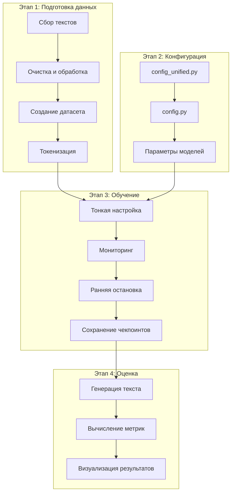
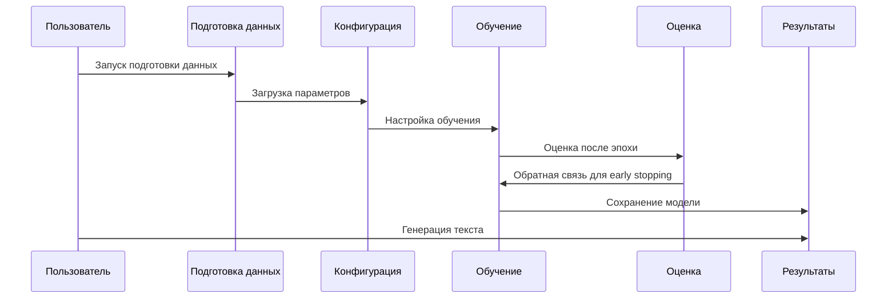

# Архитектура проекта DeadSouls

## Обзор системы

Проект представляет собой конвейер для тонкой настройки языковых моделей на текстах Николая Гоголя с использованием методов QLoRA/LoRA. Система состоит из нескольких взаимосвязанных модулей, организованных в последовательный пайплайн.



## Детализация компонентов

### 1. Модуль подготовки данных

**Основные файлы:**
- `download_gogol_texts.py` - сбор текстов из интернета
- `process_gogol_dataset.py` - очистка и обработка текстов
- `prepare_dataset.py` - создание структурированного датасета
- `create_extended_dataset.py` - расширение датасета другими авторами
- `validate_dataset.py` - валидация качества данных
- `retokenize_for_gpt2.py` - перетокенизация для конкретных моделей

**Поток данных:**
```
Исходные тексты → Очистка → Разделение на абзацы → Токенизация → Сохранение в Arrow формате
```

### 2. Модуль конфигурации

**Центральные файлы:**
- `config_unified.py` - единая конфигурация для всех скриптов
- `config.py` - устаревшая конфигурация (для обратной совместимости)

**Конфигурационные секции:**
- **Модели**: GPT-2 (русскоязычная) и Llama 8B (Saiga)
- **Гиперпараметры обучения**: LoRA rank, learning rate, batch size
- **Параметры генерации**: temperature, top-p, repetition penalty
- **Мониторинг**: TensorBoard, Weights & Biases, логирование
- **Ресурсы**: настройки GPU/CPU, квантование

### 3. Модуль обучения

**Основные скрипты:**
- `train_simple.py` - упрощенное обучение GPT-2 с early stopping
- `finetune.py` - основное обучение Llama с QLoRA
- `finetune_with_monitoring.py` - обучение с расширенным мониторингом
- `train_with_monitoring.py` - обучение с мониторингом в реальном времени
- `train_cpu_optimized.py` - оптимизированная версия для CPU
- `resume_training.py` - возобновление обучения с чекпоинта

**Архитектура обучения:**
```
Базовая модель → Применение LoRA адаптеров → Обучение на датасете Гоголя → Сохранение адаптеров
```

**Ключевые технологии:**
- **PEFT (Parameter-Efficient Fine-Tuning)**: LoRA, QLoRA
- **4-битное квантование**: для экономии памяти при работе с Llama 8B
- **Gradient Accumulation**: для эмуляции большего batch size
- **Early Stopping**: предотвращение переобучения

### 4. Модуль оценки и генерации

**Основные скрипты:**
- `generate.py` - генерация текста по промпту
- `evaluate_model.py` - оценка perplexity, BLEU, ROUGE
- `test_generation_quality.py` - тестирование качества генерации
- `visualize_results.py` - визуализация результатов обучения
- `debug_repetitions.py` - отладка повторений в сгенерированном тексте

**Метрики оценки:**
- **Perplexity**: мера неопределенности модели
- **BLEU**: совпадение n-грамм с эталонными текстами
- **ROUGE**: recall-ориентированная оценка для суммаризации
- **Качественная оценка**: анализ стилистического соответствия Гоголю

### 5. Вспомогательные модули

**Утилиты:**
- `check_gpu.py` - проверка доступности GPU
- `run_checks.py` - запуск всех проверок проекта
- `experiment_tracker.py` - отслеживание экспериментов
- `improve_data_quality.py` - улучшение качества данных

**Тестирование:**
- `test_finetune_small.py` - тестирование на маленьком датасете
- `test_training_pipeline.py` - тестирование всего пайплайна
- `test_quality_ci.py` - непрерывная интеграция качества

## Структура директорий

```
DeadSouls/
├── data/                          # Данные
│   ├── gogol_additional/          # Тексты Гоголя
│   ├── tokenized_dataset/         # Токенизированные данные
│   ├── tokenized_gpt2/            # Данные для GPT-2
│   └── *.txt, *.jsonl             # Обработанные тексты
├── gogol_finetuned_final/         # Обученные модели
│   └── checkpoint-*/              # Чекпоинты обучения
├── test_trained_model/            # Тестовые модели
├── plans/                         # Планы и рекомендации
├── logs/                          # Логи обучения
└── *.py                           # Основные скрипты
```

## Взаимодействие компонентов



## Ключевые архитектурные решения

### 1. Модульность
Каждый этап пайплайна инкапсулирован в отдельный скрипт, что позволяет:
- Легко заменять компоненты
- Тестировать отдельные этапы
- Параллелизировать выполнение

### 2. Единая конфигурация
`config_unified.py` служит единым источником истины для всех параметров:
- Упрощает воспроизводимость экспериментов
- Снижает риск рассинхронизации параметров
- Позволяет быструю настройку через один файл

### 3. Поддержка нескольких моделей
Архитектура поддерживает как легкие (GPT-2), так и тяжелые (Llama 8B) модели:
- Абстракция через конфигурационные словари
- Единые интерфейсы для разных моделей
- Автоматическое определение параметров обучения

### 4. Мониторинг и отладка
Встроенные механизмы мониторинга:
- TensorBoard для визуализации метрик
- Кастомные callback'и для early stopping
- Детальное логирование всех этапов
- Валидация данных перед обучением

### 5. Эффективность ресурсов
Оптимизация для ограниченных ресурсов:
- QLoRA для 4-битного квантования
- Gradient accumulation для эмуляции больших batch'ей
- Поддержка CPU-обучения через оптимизированные скрипты
- Чекпоинтинг для возобновления обучения

## Поток выполнения типичного эксперимента

1. **Инициализация**: `python download_gogol_texts.py`
2. **Обработка**: `python process_gogol_dataset.py`
3. **Подготовка**: `python prepare_dataset.py`
4. **Валидация**: `python validate_dataset.py`
5. **Обучение**: `python finetune_with_monitoring.py`
6. **Оценка**: `python evaluate_model.py`
7. **Генерация**: `python generate.py`

## Расширяемость

Архитектура позволяет легко:
- Добавлять новые модели через `config_unified.py`
- Внедрять новые методы тонкой настройки
- Интегрировать дополнительные метрики оценки
- Подключать внешние системы мониторинга
- Масштабировать на кластерные вычисления

## Заключение

Проект DeadSouls демонстрирует современный подход к тонкой настройке языковых моделей с акцентом на:
- **Эффективность**: использование PEFT методов
- **Воспроизводимость**: единая конфигурация
- **Мониторинг**: комплексная система отслеживания
- **Качество**: многоуровневая оценка результатов

Архитектура балансирует между гибкостью для исследований и стабильностью для production-использования.